<div align="center"> 
  
# ⚡ Daniel Joy

</div>

<div align="center">
  
  ```ascii
╔══════════════════════════════════════════════════════════════╗
 ║  🚀 Software Engineer | AI Enthusiast | System Architect    ║  
║  🌍 Morocco →  Building the Future                          ║
╚══════════════════════════════════════════════════════════════╝
```
</div>

<div align="center">
  
[](https://git.io/typing-svg)

</div>

---


## 🌐 Socials:
[](https://instagram.com/danieljoylio) [](https://tiktok.com/@@jucke978) [](https://x.com/@tjwrite24) 

# 💻 Tech Stack:
                                                                 
# 📊 GitHub Stats:
<br/>
<br/>


## 🎯 **CURRENT FOCUS**

```mermaid
graph TD
    A[🔍 Jaccard Similarity & Data Analysis] --> B[🤖 AI & Machine Learning]
    B --> C[📱 Flutter Mobile Development]
    C --> D[🏗️ System Architecture]
    D --> E[🚀 Innovation & Scaling]
    
    style A fill:#1a1a2e,stroke:#00f7ff,color:#fff
    style B fill:#16213e,stroke:#00f7ff,color:#fff
    style C fill:#0f3460,stroke:#00f7ff,color:#fff
    style D fill:#16213e,stroke:#00f7ff,color:#fff
    style E fill:#1a1a2e,stroke:#00f7ff,color:#fff
```



---

## 🌟 **PHILOSOPHY**

> *"I want every line of code to tell a story, every app a world, and every interaction a connection."*

##🧃 **Fun fact**
> *My favorite drink is tea 🍵.*
> *My heart is yours. And my repo is open source (but my feelings aren't 😌).*

## 📫 **Connect with me** 

<div align="center">

[](mailto:danieljoyta@proton.me)
[](https://linkedin.com/in/daniel-joy)

</div>

---

<div align="center">

```ascii
╔══════════════════════════════════════════════════════════════╗
║  "Building the future, one algorithm at a time"              ║
 ║  - Combining analytical depth with creative innovation -     ║  
╚══════════════════════════════════════════════════════════════╝
```


</div>
